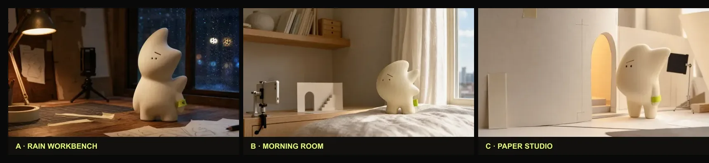

# Wave A visual v2 candidate review

Review date: 2026-07-29

Baseline: Draft PR #78 head `7bdc280`

Reviewer: Codex, independently of the generating agent

## Scorecard

Each dimension is scored from 1 (weak) to 5 (strong). Originality means the
direction avoids recognizable third-party character anatomy or styling, not
that it has been legally registered.

| Direction | Silhouette | Emotion | Scene | Material | Product proof | Originality | Total |
|---|---:|---:|---:|---:|---:|---:|---:|
| A · rainy workbench | 5 | 5 | 5 | 5 | 5 | 5 | **30/30** |
| B · morning room | 4 | 4 | 4 | 4 | 3 | 5 | 24/30 |
| C · paper studio | 4 | 3 | 4 | 4 | 4 | 5 | 24/30 |

## Decision

Direction A is selected. It holds one clear protagonist from thumbnail to Hero
size, the diagonal brow reads as quiet curiosity, and the warm task light/cool
rain light creates emotional depth without neon. Wood grain, vinyl, paper and
glass are legible. The desk also naturally supports the separate input, set,
and output evidence rail.

Direction B is attractive but reads more like general home décor and leaves
less visual evidence of a creation process. Direction C is coherent but feels
more like a clean craft catalogue and has less emotional tension.

## Acceptance boundary

- One protagonist only; no random character lineup.
- Matte ivory vinyl, asymmetric fin silhouette, diagonal brow, tiny dot eyes,
  and lime wrist tag stay fixed across the series.
- Recipe covers vary story/action, not character identity.
- No source image from Xiaohongshu or another social platform was downloaded.
- No Labubu, Hirono, DIMOO, or other known-IP trait is used.
- Editorial covers never substitute for cached Project video posters.
